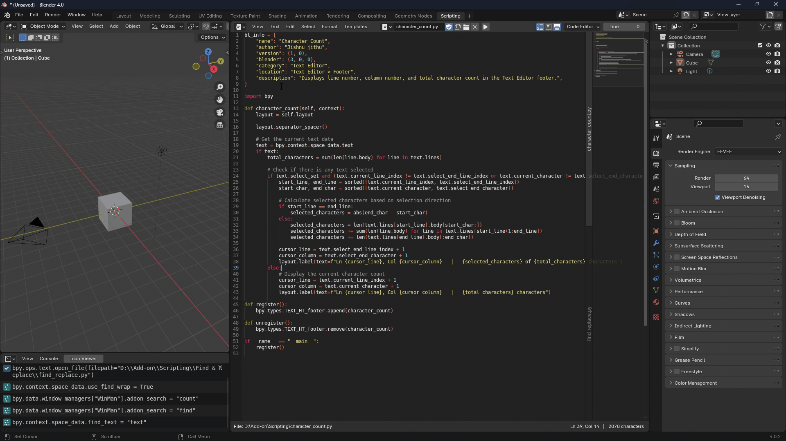
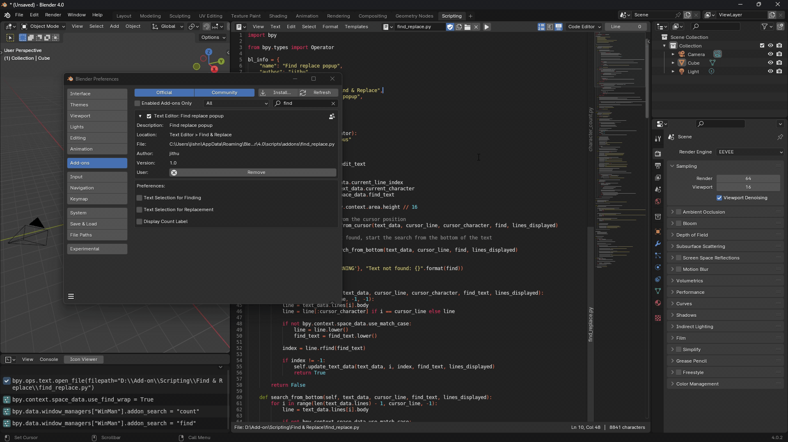

# Blender Text Editor Addons

Welcome to the collection of Blender addons designed to enhance your coding experience. These addons have been developed with a focus on improving efficiency and providing a more streamlined workflow in the Blender Text Editor.

## Character Count Addon

Shows Line Number, Column Number, and Total Character Count. Additionally, it displays the character count for the selected text.

## Code Map Addon

Enhances the coding experience by providing a navigational interface for your code. Easily traverse through classes, methods, and functions, making your coding workflow smoother. Inspired by the functionality of Pistiwique Pie Text Editor, Code Map offers a modernized and updated experience for Blender 2.8 and later.

**Usage:**
- Open the Code Map panel through the Blender UI.
- Alternatively, use the `` ` `` (backtick) shortcut key to open the Code Map popup for quick access.

## Find & Replace Popup Addon

Introduces a Find & Replace popup with features like finding previous occurrences, adding selected words to the Find and Replace field, displaying find word count, and navigation using arrow keys.

**Usage:**
- Open the popup with `F1`.
- Customize the shortcut in `Edit Menu > Find Replace Popup > Right Click > Change Shortcut`.

## Jump to Line Addon

Allows quick navigation to a specific line in the text editor. Accessible through the text editor header.

## Open Recent Addon

Designed for managing recently opened script files in the Blender Text Editor. This addon adds functionality to `Text > Open Recent` and the Sidebar > Open Recent Panel (UI List) to facilitate easy management of open recent items. You can add the current script to the open recent menu, remove items, and rearrange them by moving up or down. For clarity, this addon includes a toggle to display the filename **`__init__.py`** as the folder's name in the Open Recent menu.

## Trim Whitespace Addon

Removes all trailing whitespace characters in the current text block. Accessible through the Text Editor context menu: `Text Editor > Context Menu > Trim Whitespace`.

