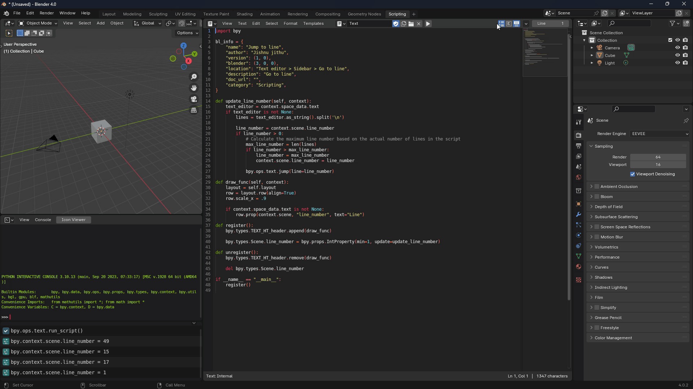

## Character Count:

### Features:

- Shows Line Number, Column Number, and Total Character Count
- Displays Character Count for Selected Text

------------

## Code Map

**Features:**
- Enhances the coding experience in Blender by providing a navigational interface for your code.
- Traverse through classes, methods, and functions easily, making your coding workflow smoother and more efficient.
- Maintains a similar user interface for familiarity with users of the Pistiwique Pie Text Editor addon.

**Usage:**
- Open the Code Map panel through the Blender UI.
- Alternatively, use the `` ` `` (backtick) shortcut key to open the Code Map popup for quick access.

*[Code Map](https://github.com/Jishnu-jithu/code-map) is inspired by the functionality of [Pistiwique Pie Text Editor](https://github.com/pistiwique/pistiwique_pie_text_editor) addon, providing a modernized and updated experience for Blender 2.8 and later.*

------------

## Find & Replace Popup

### Features:

- Find Previous
- Add Selected Word to Find and Replace Field
- Display Find Word Count
- Use Arrow Keys for Navigation

**Usage:**
- Open the popup with `F1`
- Customize the shortcut in `Edit > Find Replace Popup > Right Click > Change Shortcut`

------------

## Jump to Line

**Features:**
- Navigate quickly to a specific line in the text editor.
- Accessible through the text editor header

------------

## Open Recent

**Features:** 
- Manage filenames in the open recent menu via Sidebar > Open Recent Panel (UI List)
- Add, remove, move up, and down filenames through the UI list
- Change the filename **`__init__.py`** to the folder's name for better understanding

------------

## Trim Whitespace

**Features:**
- Removes all trailing whitespace characters in the current text block.
- Accessible through the Text Editor context menu: `Text Editor > Context Menu > Trim Whitespace`
- Provides information on the number of removed trailing whitespace characters.
